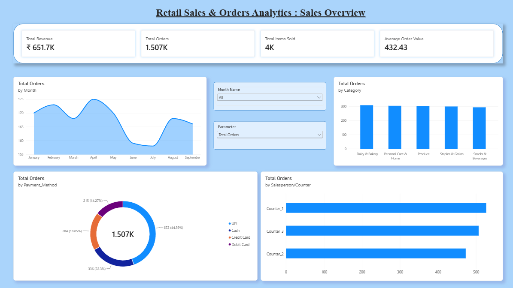
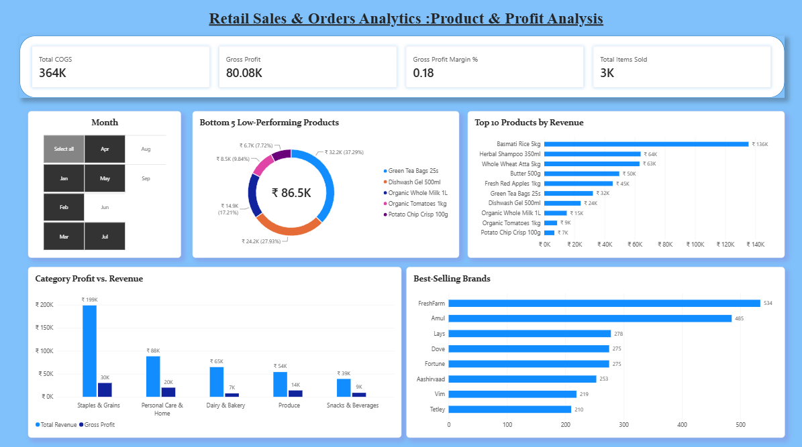

# 📊 End-to-End Grocery Retail Data Analysis Project: Power BI, DAX & Star Schema

A complete data analysis project on grocery retail performance. Raw data was modeled, cleaned, and structured using a strict **Star Schema** architecture, then transformed into interactive executive dashboards in Power BI with dynamic month filtering, category breakdowns, and product-level profitability analysis.

**Data Flow:** Raw Data → Data Modeling & Relationship Optimization → Power Query (Cleaning & Filtering) → Star Schema Setup → DAX Measures & Display Folders → Power BI (Interactive Dashboards)

---
## 📸 Screenshots

### Sales Overview
<p align="center">
  <a href="screenshots/Dashboard_1_Sales_Overview.png">
    
  </a>
</p>
---

## 📑 Table of Contents
- [Project Overview](#project-overview)
- [Business Requirements](#business-requirements)
- [KPI Requirements](#kpi-requirements)
- [Chart Requirements](#chart-requirements)
- [Data Analysis Workflow](#data-analysis-workflow)
- [Data Cleaning & Preparation](#data-cleaning-preparation)
- [Data Model & Architecture](#data-model-architecture)
- [DAX Calculations & Display Folders](#dax-calculations)
- [Dashboard Pages](#dashboard-pages)
- [Screenshots](#screenshots)
- [Key Insights](#key-insights)
- [Tech Stack](#tech-stack)
- [Folder Structure](#folder-structure)
- [What I Learned](#what-i-learned)
- [Future Improvements](#future-improvements)
- [Author](#author)

---

<a id="project-overview"></a>

## 📌 Project Overview

Retail decision-makers often struggle to evaluate revenue performance alongside real product-level gross margins. Viewing transaction totals without understanding COGS, category contribution, and payment trends can lead to poor inventory and promotional strategies.

This project delivers a complete analytics solution for a grocery chain. It addresses structural relationship ambiguities in Power BI by establishing a strict single-direction Star Schema, organizes complex calculations into structured DAX display folders, and presents executive-level insights across two focused dashboard pages: **Sales Overview** and **Product & Profit Analysis**.

---

<a id="business-requirements"></a>

## 🎯 Business Requirements

### Project: Grocery Retail Analytics Dashboard
A retail management team required an interactive Power BI solution to monitor sales trends, revenue distribution, profit margins, and top/bottom product lines across their grocery operations.

### Challenges Faced by Management
- **Unclear Margin Performance:** High sales volume did not always translate to high profitability due to untracked Cost of Goods Sold (COGS).
- **Sawtooth Trend Views:** Daily granularity made long-term trend analysis noisy and difficult to interpret.
- **Model Ambiguity:** Complex cross-filtering caused circular dependencies and calculation errors in initial reporting.
- **Fragmented Product Visibility:** Inability to instantly isolate top-performing brands and low-margin items.

### Objective
- Establish a reliable **Star Schema** data model with 1:* single-direction relationships.
- Monitor key performance metrics (Revenue, Profit, Orders, AOV) in real time.
- Identify top-revenue categories and optimize product margins.
- Provide synchronized, interactive slicers across pages for seamless temporal analysis.

---

<a id="kpi-requirements"></a>

## 📈 KPI Requirements

| # | KPI | Description | Formula / Logic |
|---|---|---|---|
| **1** | **Total Revenue** | Total gross monetary value from completed sales transactions | `SUM(RAW_Sales[Total_Sales])` |
| **2** | **Total Orders** | Count of unique invoice transactions | `DISTINCTCOUNT(RAW_Sales[Invoice_ID])` |
| **3** | **Total Items Sold** | Aggregate unit volume sold across all orders | `SUM(RAW_Sales[Quantity])` |
| **4** | **Average Order Value (AOV)** | Average revenue generated per single order | `DIVIDE([Total Revenue], [Total Orders], 0)` |
| **5** | **Total COGS** | Total Cost of Goods Sold based on unit costs | `SUMX(RAW_Sales, RAW_Sales[Quantity] * RELATED(RAW_Products[Cost_Price]))` |
| **6** | **Gross Profit** | Total profit before operational expenses | `[Total Revenue] - [Total COGS]` |
| **7** | **Gross Profit Margin %** | Percentage of sales retained as gross profit | `DIVIDE([Gross Profit], [Total Revenue], 0)` |

---

<a id="chart-requirements"></a>

## 📊 Chart Requirements

### Dashboard 1: Sales Overview
1. **Monthly Revenue Trend (Line Chart):** Evaluates overall revenue direction across months (Jan–Sep 2026) with smooth curve visual formatting.
2. **Category Revenue Breakdown (Column Chart):** Compares total revenue contribution across main product categories.
3. **Sales by Payment Method (Donut Chart):** Displays customer payment preferences (e.g., Cash, Card, UPI).
4. **Counter / Salesperson Revenue (Bar Chart):** Ranks counter performance by overall revenue contribution.

### Dashboard 2: Product & Profit Analysis
1. **Top 10 Products by Revenue (Horizontal Bar Chart):** Identifies highest revenue-generating individual inventory items.
2. **Bottom 5 Low-Performing Products (Horizontal Bar Chart):** Highlights underperforming items for stock clearance or repositioning.
3. **Category Revenue vs. Gross Profit (Clustered Column Chart):** Side-by-side evaluation of high-volume vs. high-margin product categories.
4. **Best-Selling Brands (Bar Chart):** Ranks leading supplier brands based on unit volume sold.

---

<a id="data-analysis-workflow"></a>

## 🔄 Data Analysis Workflow

```text
Step 1: Requirements Gathering & Schema Planning
        └─ Identified key KPIs (Revenue, Margin %, COGS, AOV).

Step 2: Power Query Transformation & Cleanup
        └─ Removed unneeded operational queries (RAW_Suppliers, RAW_Expenses, RAW_Inventory).
        └─ Standardized data types, trimmed text fields, and removed null dates.

Step 3: Star Schema Data Modeling
        └─ Built Dim_Date table via DAX CALENDAR function.
        └─ Set 1:* cardinality with SINGLE cross-filter direction across all dimensions.

Step 4: DAX Engineering & Organization
        └─ Created dedicated _Measures table.
        └─ Structured DAX metrics into logical Display Folders.

Step 5: Visual Dashboard Construction
        └─ Designed Page 1: Sales Overview & Page 2: Product & Profit Analysis.
        └─ Implemented synchronized header slicers across pages.
```

---

<a id="data-cleaning-preparation"></a>

## 🧹 Data Cleaning & Preparation

To guarantee calculation integrity, all dimension and fact tables underwent transformation in Power Query Editor:

- **Query Streamlining:** Removed non-essential operational tables (`RAW_Suppliers`, `RAW_Expenses`, and `RAW_Inventory`) to focus strictly on sales and product profitability.
- **Date Range Validation:** Filtered out unmapped null dates and orphan records in `RAW_Sales` that caused spurious `(blank)` options in calendar slicers.
- **Text Formatting:** Applied `TRIM` and `CLEAN` to `Category`, `Brand`, and `Payment_Method` fields to prevent grouping duplicates.
- **Data Type Enforcement:** Explicitly defined currency fields as Fixed Decimal Number, counts as Whole Number, and timestamps as Date.

---

<a id="data-model-architecture"></a>

## 📐 Data Model & Architecture

The report uses a strict Star Schema designed for DAX performance and clear filter propagation:


```text
               ┌───────────────────────┐
               │       Dim_Date        │
               └──────────┬────────────┘
                          │ 1
                          │
                          │ *
┌──────────────────┐   ┌──┴───────────────┐   ┌──────────────────┐
│  RAW_Customers   ├───┤    RAW_Sales     ├───┤   RAW_Products   │
└──────────────────┘ 1 │   (Fact Table)   │ * └──────────────────┘ 1
                       └──────────────────┘

                       ┌──────────────────┐
                       │    _Measures     │  (Disconnected
                       └──────────────────┘   Measures Table)
```

### Relationship Configuration

| From Table (Fact) | To Table (Dimension) | Foreign Key | Primary Key | Cardinality | Cross-Filter |
|---|---|---|---|---|---|
| RAW_Sales | Dim_Date | Date | Date | Many to One (*:1) | Single |
| RAW_Sales | RAW_Products | Product_ID | Product_ID | Many to One (*:1) | Single |
| RAW_Sales | RAW_Customers | Customer_ID | Customer_ID | Many to One (*:1) | Single |

> **Note on Filter Direction:** All relationships strictly use **Single** cross-filter direction. Bi-directional ("Both") filters were eliminated to prevent circular dependency loops and ambiguous calculation paths.

---

<a id="dax-calculations"></a>

## 🧮 DAX Calculations & Display Folders

All calculated metrics are housed inside a dedicated `_Measures` table and organized using Display Folders:

```text
📁 _Measures
 ├── 📁 1. Sales & Revenue
 │    ├── Total Revenue
 │    ├── Total Orders
 │    ├── Total Items Sold
 │    └── Average Order Value
 └── 📁 2. Profitability
      ├── Total COGS
      ├── Gross Profit
      └── Gross Profit Margin %
```

### Key DAX Formulas

**1. Total Revenue**
```dax
Total Revenue = SUM(RAW_Sales[Total_Sales])
```

**2. Total Orders**
```dax
Total Orders = DISTINCTCOUNT(RAW_Sales[Invoice_ID])
```

**3. Average Order Value (AOV)**
```dax
Average Order Value = DIVIDE([Total Revenue], [Total Orders], 0)
```

**4. Total COGS (Cost of Goods Sold)**
```dax
Total COGS = SUMX(RAW_Sales, RAW_Sales[Quantity] * RELATED(RAW_Products[Cost_Price]))
```

**5. Gross Profit**
```dax
Gross Profit = [Total Revenue] - [Total COGS]
```

**6. Gross Profit Margin %**
```dax
Gross Profit Margin % = DIVIDE([Gross Profit], [Total Revenue], 0)
```

**7. Dim_Date Table Generation**
```dax
Dim_Date =
VAR MinDate = MIN(RAW_Sales[Date])
VAR MaxDate = MAX(RAW_Sales[Date])
RETURN
ADDCOLUMNS (
    CALENDAR(MinDate, MaxDate),
    "Year", YEAR([Date]),
    "Month Number", MONTH([Date]),
    "Month Name", FORMAT([Date], "MMM"),
    "Month Year", FORMAT([Date], "MMM YYYY"),
    "Quarter", "Q" & FORMAT([Date], "Q"),
    "Day of Week", FORMAT([Date], "DDD"),
    "Day Number", DAY([Date])
)
```

---

<a id="dashboard-pages"></a>

## 🖥️ Dashboard Pages

### Page 1: Sales Overview
Designed to give executives an immediate snapshot of top-line revenue performance:
- **Global Header Slicer:** Month selection synced across all pages.
- **KPI Summary Cards:** Total Revenue, Total Orders, Total Items Sold, and Average Order Value.
- **Main Trend Line:** Monthly revenue curve sorted chronologically (Jan–Sep).
- **Categorical Breakdown:** Revenue distribution by product category and counter location.

### Page 2: Product & Profit Analysis
Focuses on gross margin health and item-level performance:
- **Profitability KPIs:** Gross Profit, Gross Profit Margin %, and Total COGS.
- **Top & Bottom Performers:** Dynamic Top 10 products by revenue alongside Bottom 5 low-volume items.
- **Category Profitability:** Side-by-side comparison of revenue versus gross margin dollars per category.

---

<a id="screenshots"></a>

## 📸 Screenshots

### Page 1: Sales Overview
<p align="center">
  <a href="screenshots/Dashboard_1_Sales_Overview.png">
    
  </a>
</p>

🔗 **PNG link:** [screenshots/Dashboard_1_Sales_Overview.png](screenshots/Dashboard_1_Sales_Overview.png)

### Page 2: Product & Profit Analysis
<p align="center">
  <a href="screenshots/Dashboard_2_Product_Profit.png">
    
  </a>
</p>

🔗 **PNG link:** [screenshots/Dashboard_2_Product_Profit.png](screenshots/Dashboard_2_Product_Profit.png)

---

<a id="key-insights"></a>

## 💡 Key Insights

- **Revenue vs. Margin Disconnect:** Certain high-volume categories drive substantial top-line revenue but operate on lower gross margins due to higher wholesale COGS.
- **Peak Sales Months:** Monthly trend analysis revealed distinct mid-year revenue spikes, allowing operations to align staffing and stock replenishment accordingly.
- **Payment Method Preference:** Digital payment methods (UPI/Card) account for the majority of transaction volume, supporting streamlined checkout workflows.
- **Product Concentration:** The top 10 products generate a significant percentage of overall store profits, highlighting key lines that require priority inventory level monitoring.

---

<a id="tech-stack"></a>

## 🛠️ Tech Stack & Tools Used

- **Data Modeling:** Power BI Desktop (Star Schema)
- **ETL & Data Cleaning:** Power Query (M Language)
- **Calculations:** DAX (Data Analysis Expressions)
- **Documentation & Storage:** Markdown, Git, GitHub

---

<a id="folder-structure"></a>

## 📁 Folder Structure

```text
grocery-retail-powerbi-analysis/
│
├── README.md                           <-- Main project portfolio landing page
├── .gitignore                          <-- Filters out temporary Power BI files
│
├── dashboard/
│   └── Grocery_Retail_Performance.pbix <-- Main Power BI project file
│
├── data/
│   ├── RAW_Sales.csv                   <-- Raw input dataset files
│   ├── RAW_Products.csv
│   └── RAW_Customers.csv
│
├── docs/
│   ├── DAX_Measures_Reference.md       <-- Detailed list of DAX formulas
│   └── Data_Model_Documentation.md     <-- Data dictionary & relationship specs
│
└── screenshots/
    ├── Dashboard_1_Sales_Overview.png  <-- High-resolution visual preview 1
    ├── Dashboard_2_Product_Profit.png  <-- High-resolution visual preview 2
    └── Data_Model_Star_Schema.svg      <-- Star schema diagram
```

---

<a id="what-i-learned"></a>

## 📚 What I Learned

- Resolving ambiguous multi-path relationships by enforcing strict Single Cross-Filter Direction across all Star Schema lookup dimensions.
- Designing dynamic date tables using `CALENDAR()` bound strictly to fact table transaction date boundaries (`MIN`/`MAX`).
- Structuring DAX measures into intuitive Display Folders within a standalone measures table (`_Measures`).
- Fixing date visualization jaggedness by aggregating daily granularity up to smooth monthly calendar trends.
- Configuring cross-page synchronized slicers for cohesive interactive reporting.

---

<a id="future-improvements"></a>

## 🚀 Future Improvements

- Incorporate Time Intelligence measures (Year-over-Year growth, Quarter-to-Date trends) as multi-year data becomes available.
- Implement Field Parameters to allow dynamic metric toggling across line and bar visuals.
- Build Dashboard Page 3 (Customer Segments) and Page 4 (Inventory & Store Expenses).
- Publish to Power BI Service and schedule automated daily dataset refreshes.

---

<a id="author"></a>

## 👤 Author

**Shreyansh Burman**
Aspiring Data Analyst | B.Tech CSE (Computer Science & Design), GGITS Jabalpur

📧 Email: [shreyanshburman10@gmail.com](mailto:shreyanshburman10@gmail.com)

⭐ If you found this project repository helpful, please consider giving it a star!
#
